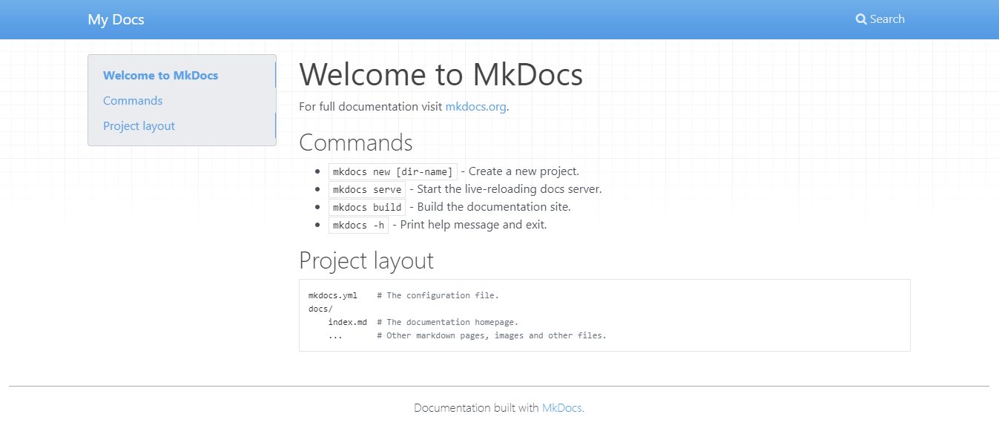

# Create new project



## mkdocs new

Create a new MkDocs project in the sandbox folder with the `mkdocs new` command:

``` powershell title="Command"
mkdocs new ./sandbox/
```

<div class="result" markdown>

``` text
INFO    -  Writing config file: ./sandbox/mkdocs.yml
INFO    -  Writing initial docs: ./sandbox/docs/index.md
```

Your `sandbox` directory should now have an `mkdocs.yml` file, and a `docs/`
folder with a single `index.md` file:

``` yaml title="mkdocs.yml"
site_name: My Docs
```

``` yaml title="docs/index.md"
# Welcome to MkDocs

For full documentation visit [mkdocs.org](https://www.mkdocs.org).

## Commands

* `mkdocs new [dir-name]` - Create a new project.
* `mkdocs serve` - Start the live-reloading docs server.
* `mkdocs build` - Build the documentation site.
* `mkdocs -h` - Print help message and exit.

## Project layout

    mkdocs.yml    # The configuration file.
    docs/
        index.md  # The documentation homepage.
        ...       # Other markdown pages, images and other files.

```

</div>

## mkdocs serve

Run the `mkdocs serve` command below, then open a browser to [http://localhost:8000/](http://localhost:8000/)
or whatever URL is provided to you if you're running this in a GitHub codespace. You should see a page like the
one in the screenshot at the top of this section. You can even edit your markdown files and __see the page refresh
in realtime!__

??? tip "Specify interface and port"
    In some cases you might need to specify an IP and/or port to bind to, or you may want to bind to all interfaces
    instead of the default of port 8000 on localhost. Add include the argument `--dev-addr 0.0.0.0:8080` to bind to all
    interfaces on port 8080 for example.

``` powershell title="Command"
mkdocs serve -f ./sandbox/mkdocs.yml
```

<div class="result" markdown>

``` text title="Output"
INFO    -  Building documentation...
INFO    -  Cleaning site directory
INFO    -  Documentation built in 0.28 seconds
INFO    -  [19:58:02] Watching paths for changes: 'sandbox/docs', 'sandbox/mkdocs.yml'
INFO    -  [19:58:02] Serving on http://127.0.0.1:8000/
INFO    -  [19:58:25] Browser connected: http://localhost:8000/
INFO    -  [19:58:28] Browser connected: http://localhost:8000/
INFO    -  [20:06:41] Browser connected: http://localhost:8000/
```

</div>
